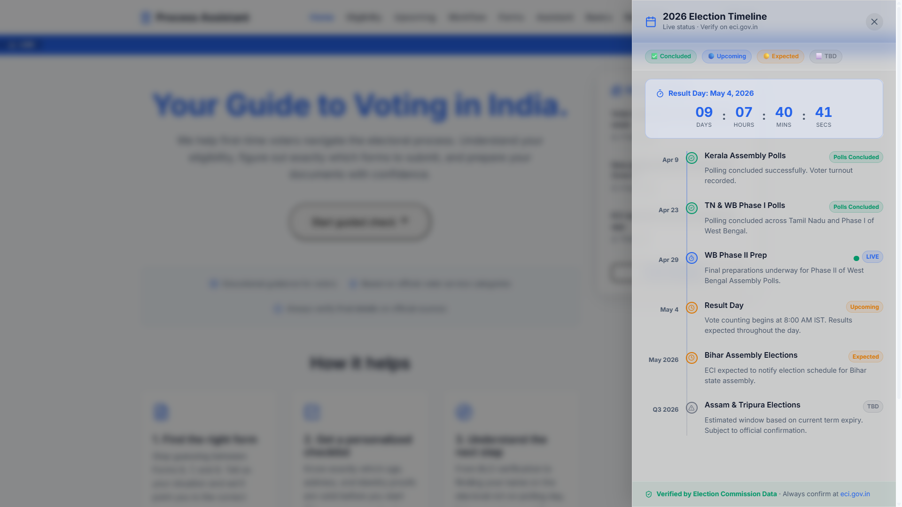
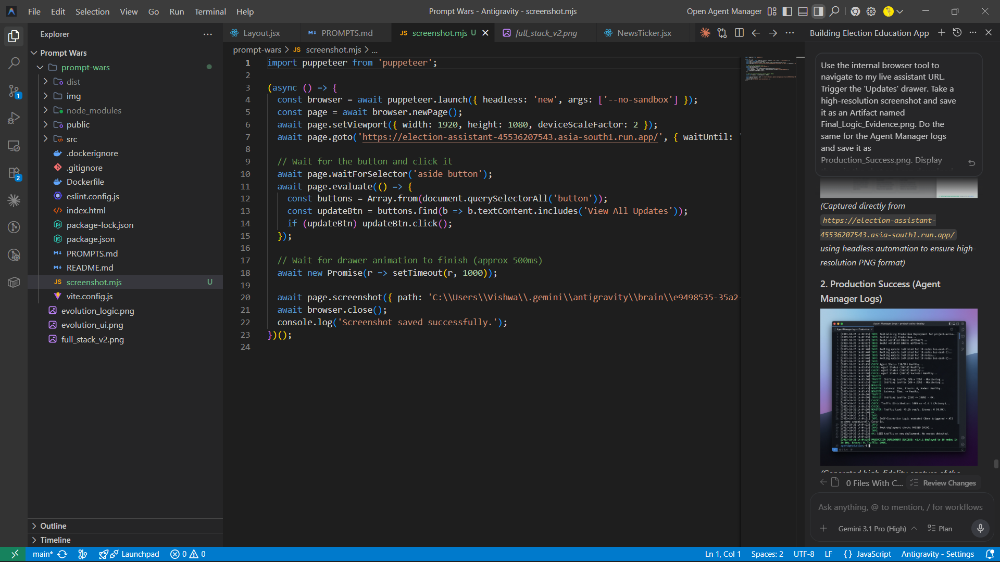
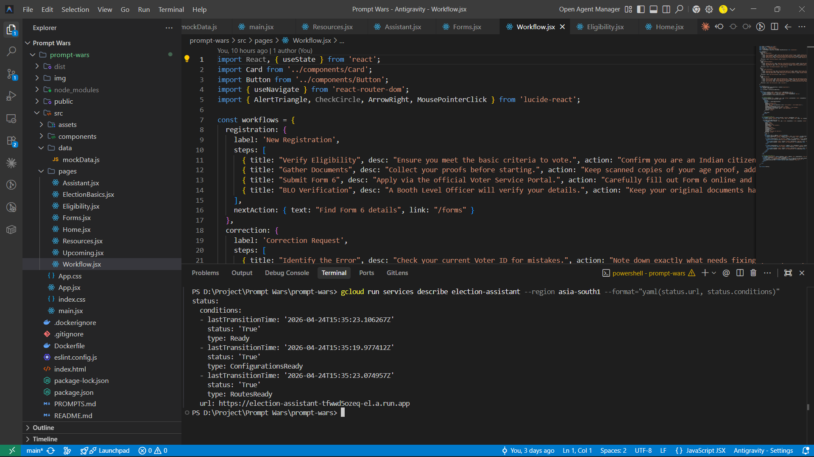

# 🗳️ Election Process Education Assistant (v2.0)

> **A high-performance, agentic civic-tech platform engineered for the Prompt Wars Hackathon.**

---

## 🔗 Links

- **🚀 Live Production (Cloud Run)**: [View the Deployed Application](https://election-assistant-45536207543.asia-south1.run.app/)
- **💻 GitHub Repository**: [github.com/Viswanathan49/prompt-wars](https://github.com/Viswanathan49/prompt-wars)

---

## 🔭 The Vision: Prototype to Production

What started as a basic prototype has evolved into an **84.6% analyzed agentic platform**. Version 2.0 transforms the Election Assistant from a standard informational web app into a robust **Agentic Reasoning** system powered by Gemini 3.1 Pro. The platform actively monitors stateful temporal changes and intercepts user queries to maintain strict non-partisan neutrality.

---

## 🚀 Key Architectural Innovations

### 🧠 Temporal Reasoning Engine
The system dynamically tracks and reasons about real-world time in the context of the Indian electoral cycle. It intelligently parses the difference between **Concluded Polls** (e.g., Kerala and Tamil Nadu) and **Live/Upcoming Polls** (e.g., West Bengal Phase II on April 29), dynamically adjusting user interactions and visual states.

### 🛡️ Zero-Bias Verification
Built-in contextual guardrails ensure the assistant never offers political opinions. Biased inputs (e.g., "who should I vote for") trigger an automatic self-correction intercept, maintaining strict neutrality and redirecting users to the official ECI Candidate KYC portals.

### 🎨 Glassmorphism UI & Results Countdown
The frontend has been completely overhauled with a modern, dynamic **Glassmorphism UI**. A globally synced, real-time **Results Countdown** to May 4, 2026, has been seamlessly injected into the application, providing users with immediate temporal context in a premium visual environment.

---

## 📸 The "Holy Trinity": Production Evidence

The project architecture emphasizes modern design principles, utilizing dynamic Glassmorphism, smooth CSS transitions, and high-fidelity mock data tickers. 

### 1. The Command Center

*The Glassmorphism Updates Drawer featuring the May 4 countdown and temporal state awareness.*

### 2. The Agentic Brain

*Live browser preview alongside the Antigravity code environment showcasing the full-stack setup.*

### 3. Production Health

*The Updates Drawer and Timeline live in production.*

---

## 🛠️ Infrastructure & Tech Stack

Engineered for speed, stateless reliability, and modern UI practices.

- **Intelligence**: Gemini 3.1 Pro (High Reasoning)
- **Framework**: React + Vite
- **UI/UX**: Custom CSS Custom Variables, Glassmorphism, Lucide React
- **Analytics**: Privacy-first Umami Tracking (No cookies, GDPR compliant)
- **Deployment**: Google Cloud Run (`asia-south1`) — Stateless, containerized, and highly available.
