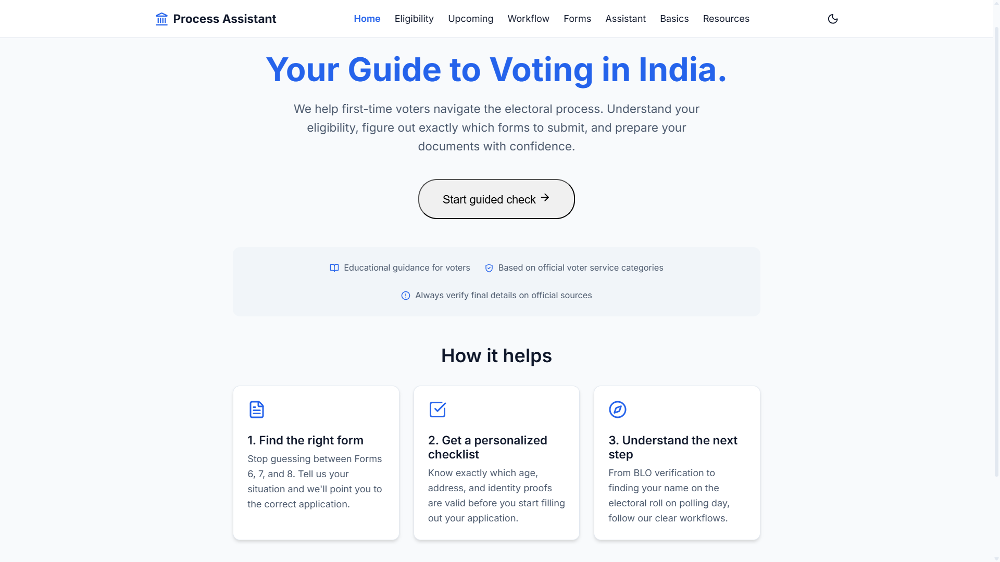
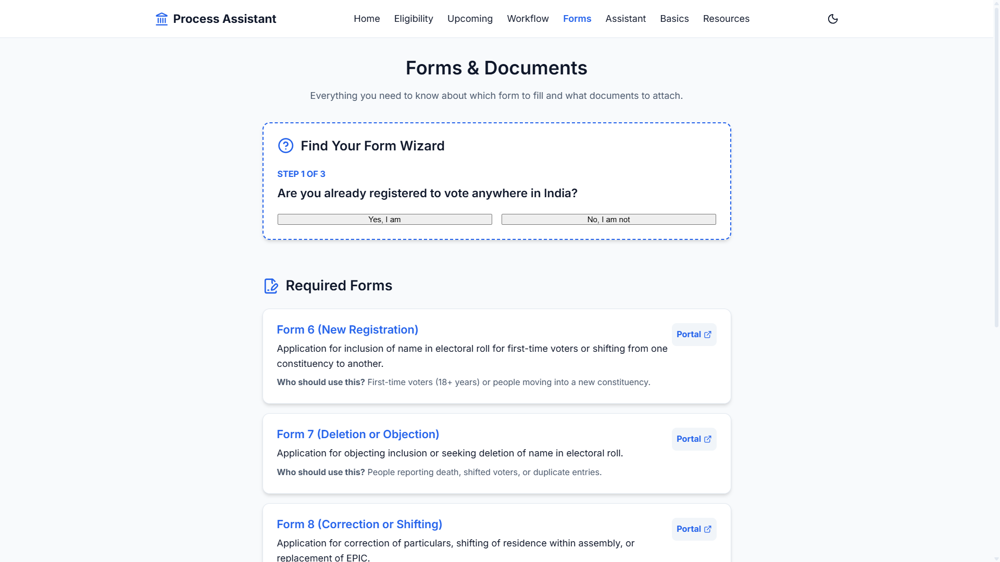
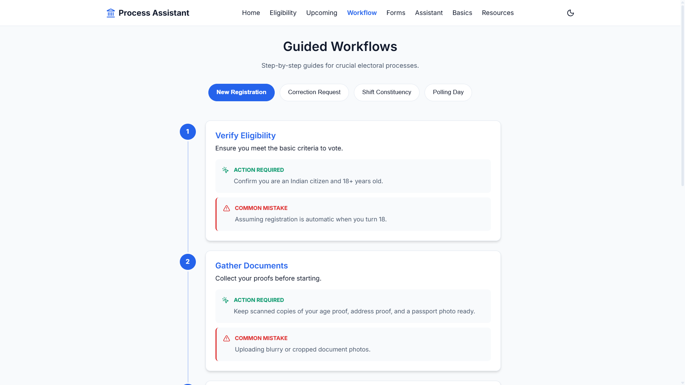
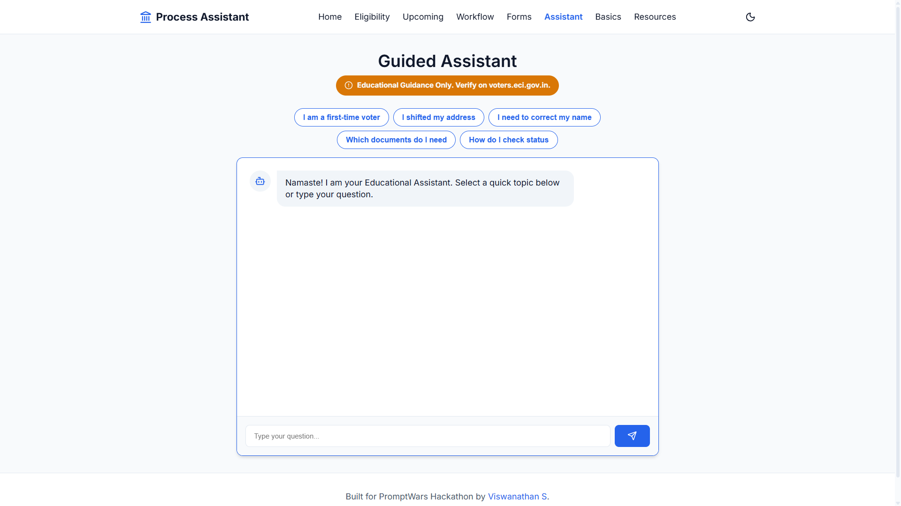

# 🗳️ Election Process Education Assistant
> **A modern, civic-tech guide simplifying the Indian electoral process for first-time voters and citizens.**

---

## 🔗 Links

- **🚀 Live Demo**: [View the Deployed Application](https://election-assistant-45536207543.asia-south1.run.app)
- **💻 GitHub Repository**: [github.com/Viswanathan49/election-process-education-assistant](https://github.com/Viswanathan49/election-process-education-assistant) *(Auto-mirrored from prompt-wars)*

---

## 📖 Overview

The **Election Process Education Assistant** is a stateless, front-end web application built to demystify the Indian voting process. It acts as an interactive, educational compass that helps citizens—especially first-time voters—understand their eligibility, figure out exactly which official forms to submit, learn fundamental democratic concepts, and navigate election day workflows without the friction of dense legal jargon.

---

## 🎯 Problem Statement

Navigating voter registration in India can be overwhelmingly complex. Citizens are frequently confused by overlapping forms (Forms 6, 7, 8), uncertain about acceptable document proofs, and unsure of the exact workflows required to participate. This confusion leads to duplicate applications, rejected forms, and ultimately, lower voter turnout. Information exists, but it is rarely presented in an actionable, user-centric, and digestible format.

---

## ✨ Key Features

- **Eligibility Guidance**: A guided, interactive wizard that determines voter eligibility and routes users to the correct next step.
- **Forms Decision Helper**: A dynamic scenario-based tool that eliminates guesswork by telling users exactly which form they need (e.g., new registration vs. address shift).
- **Workflow Timelines**: Visual, step-by-step guides breaking down complex processes like polling day preparation and registration.
- **Interactive Assistant**: A quick-action chat interface providing structured answers to frequent queries (What documents do I need? How do I check status?).
- **Upcoming Elections**: An estimated timeline for state legislative assembly elections, heavily emphasizing the need for official ECI verification.
- **Election Basics**: A structured educational repository defining core concepts (MLA vs MP, Lok Sabha vs Rajya Sabha, NOTA) and the role of the ECI.
- **Curated Resources**: A verified directory of official `.gov.in` portals and helplines, categorized cleanly by purpose to prevent phishing or misinformation.

---

## 📸 Preview

| Home Page | Interactive Form Wizard |
|:---:|:---:|
|  |  |
| *Outcome-driven landing page focusing on user journeys.* | *Guided logic to select between Form 6, 7, and 8.* |

| Guided Workflows | Educational Assistant |
|:---:|:---:|
|  |  |
| *Clear actions and common mistakes to avoid.* | *Quick, non-legalistic answers to common queries.* |

---

## 🛠️ Tech Stack

This project was built emphasizing speed, reliability, and modern UI practices without over-engineering the backend.

- **Google Antigravity**: Agentic AI assistant
- **React**: UI architecture
- **Vite**: Build tooling
- **Google Cloud Run**: Production stateless deployment
- **GitHub**: Version control and CI/CD

---

## 🗺️ How it Works (User Journey)

1. **Landing & Discovery**: The user arrives at a clean, professional homepage emphasizing three core values: finding the right form, getting a checklist, and understanding next steps.
2. **Interactive Triage**: The user jumps into the *Eligibility Checker* or *Form Wizard* to input their specific scenario (e.g., "I shifted my address locally").
3. **Actionable Results**: The application processes the input and outputs a tailored result card containing the recommended form, required documents, and a direct link to the official ECI portal.
4. **Education & Verification**: If confused, the user accesses the *Assistant*, *Election Basics*, or *Workflow* pages for deeper, structured context before heading to the official government portal to execute the task.

---

## 💡 Why This Project Matters

Democracy thrives on participation. By translating bureaucratic complexity into accessible, scenario-based digital workflows, this project lowers the barrier to entry for millions of potential voters. It represents the core of **civic-tech**: building tools that empower citizens to exercise their fundamental rights with confidence.

---

## 🚀 Deployment

The application is fully stateless, dockerized, and currently publicly accessible via **Google Cloud Run**. It serves traffic globally with high availability. 

---

## 🔮 Future Improvements

While this MVP is fully functional, the roadmap for scaling this civic-tech tool includes:
- **Multilingual Support**: Integrating local languages (Hindi, Tamil, Marathi, etc.) to reach rural and non-English speaking demographics.
- **Better Personalization**: Allowing users to save their checklist state locally without requiring an account.
- **Richer Assistant Guidance**: Hooking the mock assistant into a live RAG pipeline powered by the latest ECI documentation.
- **Stronger Official Data Integrations**: Pulling live election dates and polling booth data securely via official APIs.
- **Expanded Education Content**: Adding candidate KYC research workflows and local body election logic.

---

## 🏆 Built For

Created rapidly for **PromptWars Virtual** using **Google Antigravity**.
